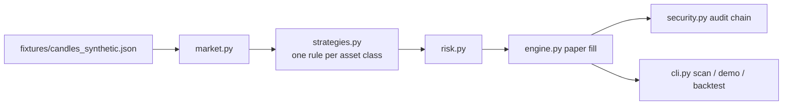

# Architecture

```mermaid
flowchart LR
    FX["fixtures/candles_synthetic.json"] --> M["market.py"]
    M --> ST["strategies.py<br/>one rule per asset class"]
    ST --> RK["risk.py"]
    RK --> EN["engine.py paper fill"]
    EN --> AU["security.py audit chain"]
    EN --> CLI["cli.py scan / demo / backtest"]
```

Runtime dependencies are the Python standard library. Tests inject fetchers
and never open a socket. See [security-architecture.md](security-architecture.md).
