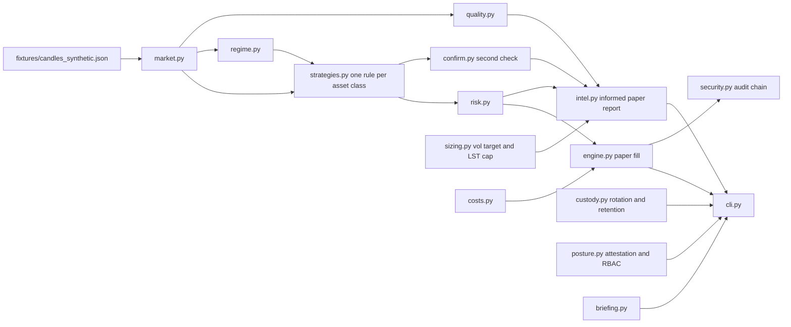

# Architecture

`scan` and `backtest` keep the v0.3 paper path. `intel` is the v0.4 information path: quality, confirmation, and volatility targeting. Neither path can place a live order.

Runtime dependencies are the Python standard library. Tests inject fetchers and never open a socket. See [security-architecture.md](security-architecture.md), [data-security-architecture.md](data-security-architecture.md), and [asset-class-strategies.md](asset-class-strategies.md).
