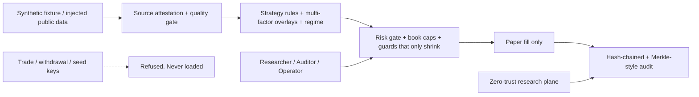

# Enhanced Cyber and Data Security Architecture — v0.24

Research control plane for a paper-only cryptocurrency information system. Not a certified product, not legal advice, and not an execution system. There is no order router and no path to live trading.

## Trust boundaries and zones

Zones: ingest, research, audit, egress. Execution is not a zone. Secret, personal, wallet, and trade-key classes cannot reach egress or research storage.

## Roles (unchanged invariants)

| Role | Allowed | Denied |
|------|---------|--------|
| Researcher | scan, backtest, read research records | place order, withdraw, enable live, append audit |
| Auditor | read/verify audit, scan, dual-control confirm | place order, withdraw, enable live |
| Operator | scan, kill switch, read audit | place order, withdraw, enable live, sign research digests |

No trader role exists. Dual control required for kill-switch clear. Sessions are identity-bound and non-reusable across roles.

## Data classification and handling

| Class | Examples | Handling |
|-------|----------|----------|
| Public market | OHLCV, funding, symbol | Synthetic only in this tree; attest source |
| Research internal | Signals, scores, digests | Redacted before any external brief |
| Audit | Hash chain, lineage | Immutable; dual control to restore |
| Secret | API keys, seeds, private keys | Refused; zero retention; never logged |
| Personal | Email, NRIC, phone | Tripwire; banned from fixtures |
| Sensitive identifier | Wallet address | Redacted; banned from fixtures |

Zero retention for secrets and personal data. Encryption-at-rest simulation for audit logs (AES-256 key separate from research keys). Keys are separated: market-read, audit-sign, break-glass — none can trade.

## Enhanced controls (v0.24)

1. **Strategy integrity guard**: Parameter digest must match catalog. Any drift or injection attempt zeros directional size and alerts.
2. **Multi-factor confirmation overlay**: Volume, momentum, and relative-strength factors must align; failure zeros or halves size.
3. **Adaptive volatility targeting**: Size scaled by ATR percentile; can only shrink.
4. **Audit Merkle extension**: Periodic Merkle root over the hash chain for faster integrity verification.
5. **Data lineage plane**: Every signal carries source attestation digest + parameter digest.
6. **Anomaly detection on audit**: Simple statistical watch for unusual action sequences (research only).
7. **Supply-chain snapshot**: Dependency and fixture digests recorded offline.
8. **Residency and egress**: Research/audit/secret/personal classes cannot leave origin region. Egress allowlist remains public market HTTPS only; order/withdraw paths refused.
9. **Key ceremony and rotation**: Read-only market keys rotate every 90 days; ceremony checklist required; no key material stored.
10. **Incident playbook**: Kill switch → freeze audit → human review. Recovery cannot enable live trading. Break-glass cannot place orders.

## Threat model extensions (STRIDE + crypto-specific)

| Threat | Control |
|--------|---------|
| Parameter injection / strategy drift | Catalog digest + integrity guard |
| Secret commitment or paste | gitleaks, redaction, refuse_trade_secret, zero retention |
| Stale/jumped feed | Quality gate + feed status + freshness SLA |
| Audit tamper | Hash chain + Merkle root + dual control |
| Privilege creep / role reuse | Identity-bound sessions, no trader role, dual control |
| Data exfiltration | DLP patterns, residency plane, redaction, egress block |
| Live-order mistake | No live client, mode guard, RBAC deny, no execution zone |
| Supply-chain compromise | Offline dependency snapshot, attested fixtures |

## Operating rules

- Paper only. `assert_paper_only` and mode guards refuse anything else.
- All overlays, sleeves, guards, and multi-factor checks can only shrink paper size.
- Logs and briefs pass through `redact`.
- Promoting any signal to a broker is a separate, human-approved system outside this repository.
- This design maps to research controls; it is not a NIST CSF, ISO 27001, SOC 2, or PDPA certification.

See also prior version documents (v06–v23) for layered history. All prior invariants remain in force.
