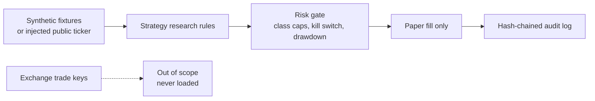

# Security architecture

## Trust boundaries

The system has no order router. `assert_paper_only` refuses any mode other than
`PAPER`. A kill switch and a drawdown halt sit in front of size allocation.

## Data classes

| Field | Class | Handling |
|---|---|---|
| Symbol, OHLCV | Public market | Synthetic in this repo |
| Funding rate | Public market | Research feature only |
| Exchange API key | Secret | Environment only, never logged or fixtured |
| Wallet address | Sensitive identifier | Redacted, banned from fixtures |
| Email, NRIC, phone | Personal | Tripwire in `scripts/check_pdpa.py` |

PDPA note: the tripwire is not a data-loss-prevention product. A production
deployment still needs access control, vendor review, and a human DPO decision.
Wallet addresses can be personal data depending on context; this repo does not
store them.

## Threats and controls

| Threat | Control |
|---|---|
| Secret committed | gitleaks CI, redaction, no key loader |
| Strategy injection via fixture | Fixtures must be labelled SYNTHETIC; loader rejects others |
| Oversized risk on thin assets | Per-class cap and confidence floor |
| Runaway loss | Drawdown halt and kill switch |
| Audit tamper | SHA-256 chain over sequence, action, detail |
| Live-order mistake | No live client; mode guard |
| Personal data in agent context | AGENTS.md ban plus CI tripwire |

## Operating rules

- Market-data credentials, if ever added, stay read-only and separate from any future trade credential.
- Logs pass through `redact` before they are stored.
- Default deployment is research. Promoting a signal to a broker is a separate, human-approved system.
