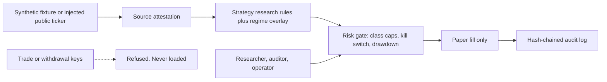

# Security architecture

Version 0.3 extends the control plane. It is still a research design, not a
certified security product and not legal advice. Control ids are a reviewer
map, not a NIST certification.

## Trust boundaries

The system has no order router. `assert_paper_only` refuses any mode other than
`PAPER`. `refuse_trade_secret` rejects names that look like trade, withdraw,
transfer, or order credentials. Roles cannot enable live trading.

## Roles

| Role | Allowed | Denied |
|---|---|---|
| Researcher | scan, backtest, read audit | place order, withdraw, enable live |
| Auditor | read audit, verify chain, scan | place order, withdraw, enable live |
| Operator | scan, kill switch, read audit | place order, withdraw, enable live |

There is no trader role. Promoting a signal to a broker is a separate system.

## Data classes

| Field | Class | Handling |
|---|---|---|
| Symbol, OHLCV | Public market | Synthetic in this repo |
| Funding rate | Public market | Research feature only |
| Source label | Integrity | Must be SYNTHETIC or PUBLIC_READ |
| Read-only market key | Secret, optional | Name must say read, market, or public. Never logged |
| Trade or withdrawal key | Secret | Refused |
| Wallet address | Sensitive identifier | Redacted, banned from fixtures |
| Email, NRIC, phone | Personal | Tripwire in `scripts/check_pdpa.py` |

PDPA note: the tripwire is not a data-loss-prevention product. A production
deployment still needs access control, vendor review, and a human DPO decision.
Wallet addresses can be personal data depending on context; this repo does not
store them.

## Feed integrity

`feed_status` flags a non-positive price, a print older than 15 minutes, or a
jump above 25% versus the prior print. Tests inject the payload. The default
path does not open a socket.

`attest_source` hashes the label plus body so a fixture swap changes the digest.
The loader still rejects anything that is not labelled SYNTHETIC.

## Threats and controls

| Threat | Control |
|---|---|
| Secret committed | gitleaks CI, redaction, no key loader |
| Trade key pasted into config | `refuse_trade_secret` |
| Strategy injection via fixture | SYNTHETIC label required, source attestation |
| Stale or jumped public ticker | feed status watch or high |
| Oversized risk on thin assets | Per-class cap, confidence floor, class cost |
| Runaway loss | Drawdown halt and kill switch |
| Audit tamper | SHA-256 chain over sequence, action, detail |
| Live-order mistake | No live client; mode guard; RBAC deny |
| Personal data in agent context | AGENTS.md ban plus CI tripwire |
| Privilege creep | No role can place an order |

## Incident handling

1. Engage the kill switch. New paper size goes to zero.
2. Freeze the audit chain and record the source attestation digest.
3. If a secret was pasted, rotate it outside this repo and purge it from history.
4. Do not open a public issue that contains a secret or a wallet address.
5. A human reviews before the kill switch is cleared.

## Version 0.3 controls

- Parameter catalog digest (`catalog.parameter_digest`) is printed by `crypto-intel controls`.
- Egress policy allows only public market hosts over HTTPS and refuses paths containing order, withdraw, transfer, or `/sapi/`. The check does not open a socket.
- Kill-switch clear is dual control: the operator requests, the auditor confirms. The same role cannot both request and confirm.
- Book caps sit after the class risk gate so one asset class cannot consume the whole research budget.

## Operating rules

- Market-data credentials, if ever added, stay read-only and separate from any future trade credential.
- Logs pass through `redact` before they are stored.
- Default deployment is research. Promoting a signal to a broker is a separate, human-approved system.
